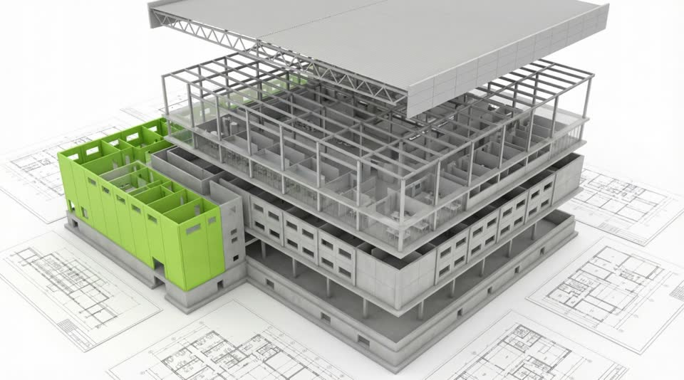

# Projet EBIM — Site vitrine BIM Management

## Contexte
eBIM Ingénierie est un bureau d'études réunionnais spécialisé en BIM Management.
Implanté à La Réunion, il intervient dans l'Océan Indien (Réunion, Mayotte, Mozambique, Afrique du Sud)
et en France métropolitaine.
Dirigé par Arnaud PLASSARD, ingénieur diplômé du mastère spécialisé BIM (ESTP / ENPC – Promo 2016).

## Stack technique
- HTML5, CSS3, JavaScript vanilla uniquement
- Aucun framework, aucune dépendance npm
- Fichiers : `index.html`, `style.css`, `script.js`
- Logo récupéré depuis : https://ebim-ing.re/images/ebim-logo.svg

## Structure des fichiers
```
/
├── index.html
├── style.css
├── script.js
└── assets/
    └── images/
```

## Navigation du site
1. Accueil
2. Missions BIM
3. Modélisation de l'existant
4. Formations BIM
5. Contact

---

## Contenu — Section Accueil (Hero)
**Accroche principale :**
> BIM – Modélisation de l'existant – Commissionnement – Formation

**Présentation :**
Bureau d'études réunionnais spécialisé dans le « Building Information Modeling » (BIM),
eBIM Ingénierie assure plusieurs types de missions autour du Management BIM :
- Accompagnement à maîtrise d'ouvrage (AMO BIM)
- Gestion de projet de construction (BIM Management, Modélisation de l'existant, création de DOE numérique, synthèse numérique)
- Ingénierie de maintenance (DIUEM, Commissionnement)
- Formations BIM multi-niveaux

---

## Contenu — Section Services (Missions BIM)

### AMO BIM
Accompagnement et encadrement des projets BIM pour la maîtrise d'ouvrage, de la phase de programmation jusqu'à l'exploitation de la maquette numérique.
- Définition des objectifs et de la stratégie BIM
- Rédaction des documents de référence (Cahier des charges BIM, Charte BIM)
- Accompagnement dans la sélection des maîtrises d'œuvre et entreprises
- Contrôle de la maquette numérique durant les phases clés
- Accompagnement dans la mise en exploitation des maquettes numériques

### BIM Management
Organisation des méthodes et processus pour l'établissement et le suivi de la maquette numérique.
- Rédaction et mise en place de la Convention BIM
- Gestion de la plateforme collaborative
- Coordination et suivi des maquettes de maîtrise d'œuvre et d'exécution
- Garant de la cohérence et de l'interopérabilité des maquettes numériques

### Synthèse numérique
Coordination des lots techniques et architecturaux sur la base de maquettes numériques, pour détecter les conflits/clashs entre lots.
- Mise en place d'une plateforme d'échange de données BIM
- Vérification des maquettes numériques
- Détection des collisions et édition des rapports

### Modélisation de l'existant
Remise en maquette d'ouvrage existant (à partir de plans ou nuage de points).
- Réhabilitation / Rénovation
- Mise en exploitation (maquette telle que construite)
- Communication (visite virtuelle)
- Gestion et planification de chantier

### Commissionnement
Processus de contrôle qualité structuré sur toutes les phases du projet, de la programmation à la livraison, pour garantir les performances énergétiques visées.

### Formations BIM
Formations logiciels et processus BIM adaptées à tous les professionnels du bâtiment.
Organisme certifié Qualiopi. Déclaration d'activité n° 04 97 31 52 497.

**Chiffres clés formations :**
- 94% des objectifs fixés atteints en fin de formation
- 97% des apprenants satisfaits
- 97% du programme adapté aux besoins des formés

**Formations disponibles :**
- REVIT Initiation (35h)
- REVIT Perfectionnement MEP / Fluides (21h)
- REVIT – Travaux Collaboratifs BIM (14h)
- ArchiCAD Initiation (35h)
- Manipulation d'Outils BIM (7h)
- Gestion de projet BIM (14h)
- Le BIM pour la Maîtrise d'Ouvrage (14h)

---

## Contenu — Références (Modélisation)
- **Opération "Victoria"** — 220 logements + 20 commerces, Saint-André. MO : SHLMR / Action Logement
- **Opération "Danone" Le Port** — Usine de production. MO : Danone / Groupe GBH
- **Opération "Carrefour Ste Clotilde"** — Centre commercial. MO : FICASA / Groupe GBH
- **Opération "CHU – Bloc opératoire"** — Bâtiment hospitalier, Saint-Denis. MO : CHU Félix Guyon

---

## Contenu — Partenaires
- **Arcad Ingénierie** — acquisition et traitement de données 3D / scanner 3D
- **Vibrason Production** — visite virtuelle et communication

---

## Style visuel
- Moderne et dynamique
- Palette sombre avec couleur d'accent (bleu tech)
- Typographie claire, espacements généreux
- Animations au scroll
- Responsive mobile en priorité

## Technique — Animation vidéo pilotée par le scroll (Scroll-driven frame animation)

### Principe
Pré-extraire les frames d'une vidéo en JPEG, les afficher en arrière-plan fixe via un `` dont le `src` change en fonction du scroll. Le contenu du site s'affiche par-dessus avec des fonds semi-transparents.

### Extraction des frames
```bash
ffmpeg -i video.mp4 -qscale:v 2 assets/videos/frames/frame-%04d.jpg
```
- `-qscale:v 2` : qualité maximale
- Nombre de frames = durée × fps (ex: 5s × 24fps = 121 frames)

### Structure HTML
```html
<!-- Juste après <body>, avant tout le contenu -->

```

### CSS
```css
.scroll-video-bg {
  position: fixed; top: 0; left: 0;
  width: 100vw; height: 100vh;
  z-index: 0; object-fit: cover; pointer-events: none;
}
main, footer { position: relative; z-index: 1; }
/* Sections au-dessus : fonds semi-transparents (rgba) pour voir les frames */
```

### JavaScript — Points critiques
1. **Position absolue d'un élément** : ne jamais utiliser `el.offsetTop` seul si un parent a `position: relative`. Remonter la chaîne `offsetParent` :
   ```js
   function getAbsoluteBottom(el) {
     var top = 0;
     var current = el;
     while (current) {
       top += current.offsetTop || 0;
       current = current.offsetParent;
     }
     return top + el.offsetHeight;
   }
   ```
2. **Endpoint** = position absolue du bas de la section cible − `window.innerHeight` (pour que la dernière frame apparaisse quand le bas de la section touche le bas du viewport).
3. **Calculer dynamiquement** à chaque scroll (pas de cache) pour gérer les changements de layout (polices, images, resize).
4. **Scroll restoration** : désactiver au refresh pour toujours démarrer en haut :
   ```js
   if ('scrollRestoration' in history) history.scrollRestoration = 'manual';
   window.scrollTo(0, 0);
   ```
5. **Pré-chargement** : créer `new Image()` pour chaque frame au démarrage pour éviter le clignotement.

### Pièges rencontrés (à éviter)
- `<canvas>` + `drawImage()` → instable, préférer un simple `` avec changement de `src`
- `<video>` + `currentTime` côté navigateur → trop lent et buggé
- `offsetTop` avec `position: relative` sur un parent → valeur fausse, utiliser `offsetParent` chain
- Cache du endpoint au `load` → peut être faux si le layout bouge après, recalculer à chaque scroll
- Trop peu de frames (6-30) → animation saccadée, viser ≥ 60 frames
- Fonds opaques sur les sections → masquent complètement l'arrière-plan, utiliser `rgba()`

---

## Règles de travail
- Commits en français, clairs et descriptifs
- Toujours créer une Pull Request, jamais committer directement sur `main`
- Code commenté en français
- Ne jamais copier le style du site actuel (ebim-ing.re) — contenu uniquement
- Suivre les directives de design définies dans `.claude/SKILL.md` pour tous les fichiers CSS et visuels
- Utiliser le skill UI/UX Pro Max pour les décisions de design : `python3 .claude/ui-ux-pro-max/scripts/search.py "<query>" --domain <style|typography|color|ux>`
